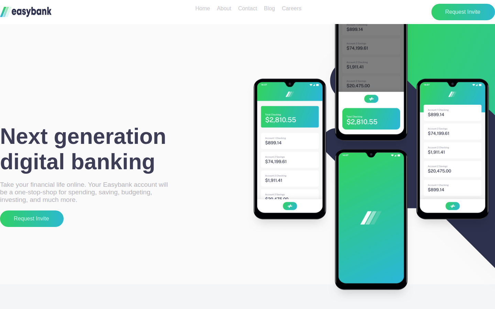
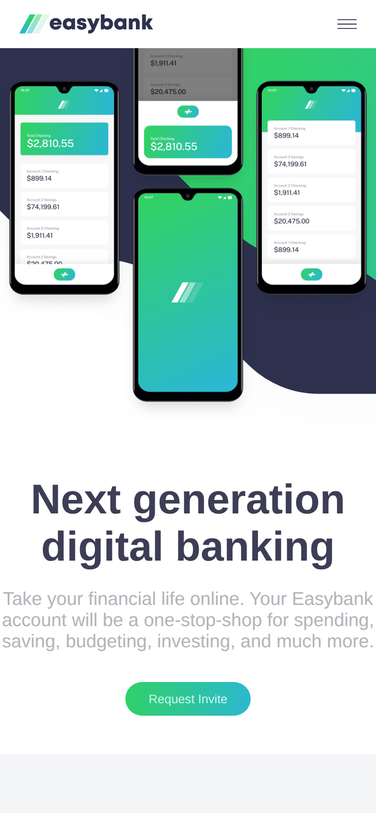

# Easybank Landing Page

A landing page for a fictional digital bank, built with React components from a [Frontend Mentor](https://www.frontendmentor.io/challenges) design.

Live site: [easyeasybanks.netlify.app](https://easyeasybanks.netlify.app/)





## Features

- Hero section with phone mockups over a layered background
- "Why choose Easybank" feature grid
- Latest articles section with image cards
- Header with navigation and a mobile menu, and a footer with links and social icons
- Responsive layout for desktop and mobile

## Built with

- React 18 (Create React App)
- Reusable components: `Button`, `HeaderLinks`, `Item`, `LatestArticlesItem`
- CSS with Flexbox and media queries

## Run locally

```bash
npm install
npm start        # http://localhost:3000
npm run build    # production build in build/
```
